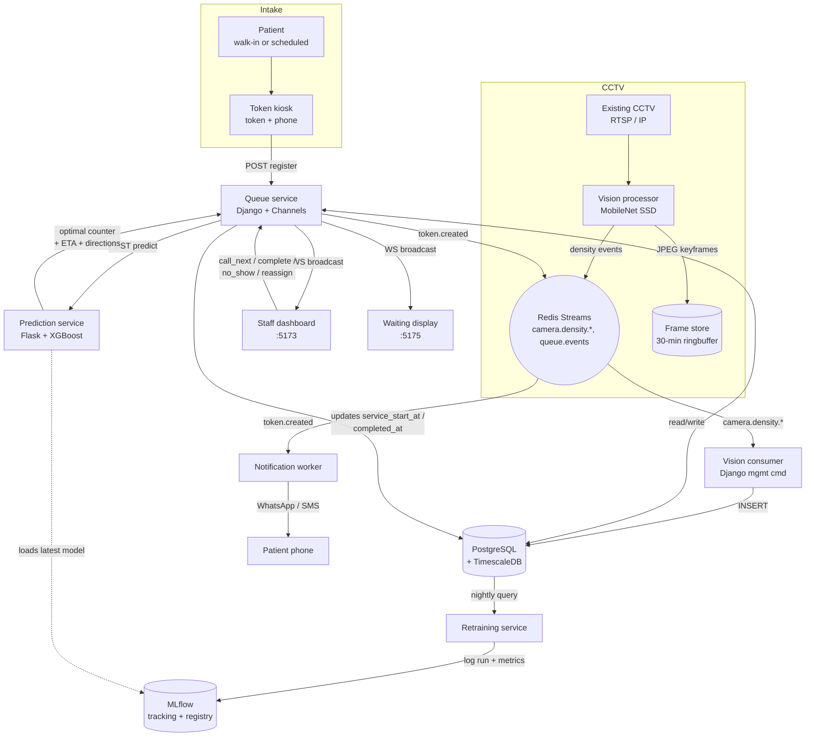

# System Architecture — Smart Queue Management

This document describes the data flow, service responsibilities, and key contracts of the system as it actually exists in the codebase.

## High-level data flow



## Services

| Service | Tech | Port | Role |
| --- | --- | --- | --- |
| `db` | TimescaleDB on Postgres 15 | 5432 | Source of truth + time-series for vision metrics |
| `redis` | Redis 7 | 6379 | Stream bus (`camera.density.*`, `queue.events`) + Channels layer |
| `mlflow` | mlflow 2.18 | 5000 | Tracking server (sqlite backend, `/mlflow/artifacts/`) |
| `queue-service` | Django 4.2 + Channels + Daphne | 8000 | REST + WebSocket source of truth |
| `vision-service` | OpenCV + MobileNet SSD | — | Density producer + keyframe ringbuffer |
| `vision-consumer` | Django mgmt command | — | Persists `camera.density.*` → `core_visionmetric` |
| `prediction-service` | Flask + Gunicorn + XGBoost | 8001 | `/api/predict/` inference + route optimisation |
| `notification-service` | asyncio worker + Twilio | — | Consumes `queue.events`, sends WhatsApp with SMS fallback |
| `retraining-service` | `schedule` loop | — | Nightly retrain → MLflow run + metrics |
| `staff-dashboard` | React + Vite | 5173 | Live counter table + bottleneck banner + manual actions |
| `waiting-display` | React + Vite | 5175 | Public "Now Serving" board (privacy-masked names) |

## Token lifecycle

```
WAITING ──call_next──▶ IN_PROGRESS ──complete──▶ COMPLETED
   │                       │
   │                       └──no_show──▶ CANCELLED
   │
   └──no_show──▶ CANCELLED
```

## Smart Redirection & Load-Balancing

When a patient registers for a test via the `/api/queue/register/` endpoint:
1. **Queue Check**: The queue-service checks the count of waiting patients for the requested test type (e.g., Blood Test).
2. **Alternative Evaluation**: If the queue is long (>= 3 waiting), the service automatically evaluates the queue depths of other test types (e.g., X-Ray, MRI, PFT).
3. **Routing Recommendation**: If an alternative test has a significantly shorter queue (at least 2 fewer waiting patients), the system appends a redirection recommendation to the token's directions.
4. **Omnichannel Delivery**: This recommendation is displayed on the portals/dashboards and delivered via WhatsApp/SMS to help load-balance patient flow.

## WhatsApp & Simulation Guardrails

- **WhatsApp Modes**: The notification-service supports both Twilio WhatsApp Business template-based messages and free-form text. If `TWILIO_WHATSAPP_CONTENT_SID` is blank, it automatically falls back to sending clean, template-free WhatsApp messages.
- **Sandbox Adapter**: Dynamically reformats variables if using Twilio's standard pre-approved Sandbox template (`HXb5b62575e6e4ff6129ad7c8efe1f983e`) to output natural notifications without scheduling/doctor appointment wording.
- **Simulation Isolation**: Background simulated traffic (`scripts/simulate_queue.py`) is marked with an `is_simulated: true` metadata flag. The notification-service intercepts this flag to bypass live Twilio API calls for simulated events, protecting Twilio account credits.

## Security & scaling

- **No Patient Interface**: Patients receive one-way notifications only. No portal, no login, no WebSocket.
- **Boundaries**: only `queue-service`, `prediction-service`, `mlflow`, and the frontends publish ports; everything else talks over the internal Docker network.
- **TLS**: terminate in Nginx in front of the stack — Django honours `SECURE_PROXY_SSL_HEADER` and emits HSTS automatically when `DJANGO_DEBUG=false`.
- **Async decoupling**: notifications, vision analysis, and retraining are all decoupled via Redis or scheduled jobs so the kiosk endpoint stays sub-second.
- **Horizontal scaling**: every backend service is stateless apart from Postgres, Redis, MLflow, and the frame-store volume.
