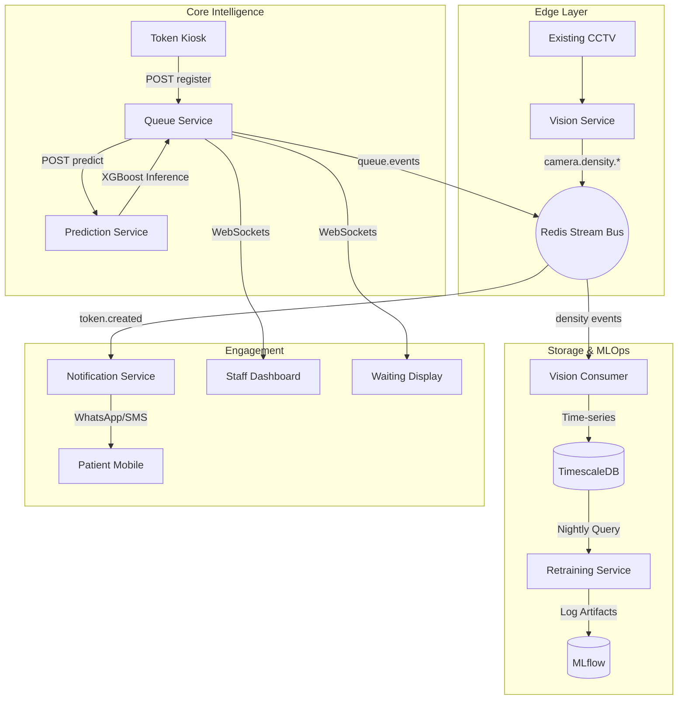

# Smart Queue Management

A production-grade, event-driven microservices system that optimizes hospital patient flow using real-time CCTV analysis and AI-driven wait time predictions.

## 🏗️ Architecture



## 🚀 Quick Start

### 1. Requirements
- Docker & Docker Compose
- Twilio Account (for notifications)
- MLflow (bundled)

### 2. Launch Stack
```bash
docker-compose up --build -d
```

### 3. Initialize Database
```bash
# Run migrations
docker-compose exec queue-service python manage.py migrate

# Seed hospital counters and service types
docker-compose exec queue-service python manage.py seed_data
```

### 4. Run Simulation
```bash
python scripts/simulate_queue.py
```

## 📡 Access Points
- **Staff Dashboard**: `http://localhost:5173` (Manage queues, call patients)
- **Waiting Display**: `http://localhost:5175` (Public TV screen)
- **API Documentation**: `http://localhost:8000/api/`
- **MLflow UI**: `http://localhost:5000`

## ⚙️ Configuration (.env)

| Variable | Description |
|----------|-------------|
| `VIDEO_SOURCE` | RTSP URL or MP4 file for CCTV input |
| `ZONE_ID` | Identifier for the waiting area camera |
| `TWILIO_ACCOUNT_SID` | Twilio SID for WhatsApp/SMS |
| `TWILIO_AUTH_TOKEN` | Twilio Auth Token |
| `WAIT_TIME_THRESHOLD_RED` | Minutes before a counter turns red (default 20) |

## 🔒 Security
- **JWT Auth**: Planned for production endpoints.
- **One-way Push**: Patients have no portal/login; they only receive push notifications.
- **Privacy Masking**: Public displays use `Name I.` format.
